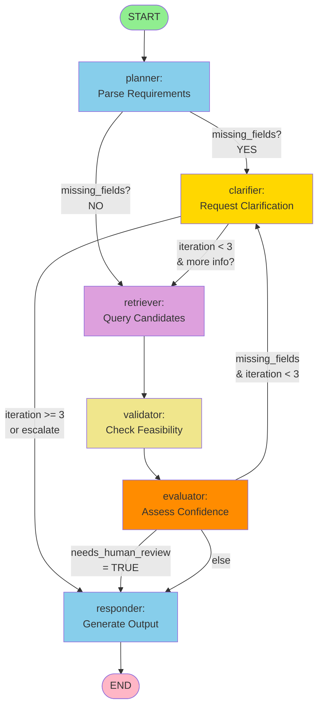

# SICK Sensor Orchestrator - Graph Specification

**Version**: 1.0  
**Date**: 2026-07-25  
**Status**: Active

---

## 1. Overview

The SICK Sensor Orchestrator uses **LangGraph** to orchestrate a multi-agent workflow that:
1. Parses and validates user requirements
2. Iteratively clarifies missing information (max 3 cycles)
3. Retrieves sensor candidates from database
4. Validates feasibility of candidates
5. Evaluates confidence and determines recommendation viability
6. Generates final output (recommendation, escalation, or clarification request)

---

## 2. Graph Diagram



---

## 3. Transition Table

| From Node | To Node | Condition | Route Function | Action |
|-----------|---------|-----------|-----------------|--------|
| START | planner | Always | - | Entry point |
| **planner** | clarifier | `missing_fields` is not empty | `route_from_planner()` | Requires clarification |
| **planner** | retriever | `missing_fields` is empty | `route_from_planner()` | All required fields present |
| **clarifier** | retriever | `iteration_count < 3` | `route_from_clarifier()` | Attempt retrieval with refined data |
| **clarifier** | responder | `iteration_count >= 3` | `route_from_clarifier()` | Escalate: iteration limit reached |
| retriever | validator | Always | - | Fixed edge: always proceed to validation |
| validator | evaluator | Always | - | Fixed edge: always evaluate confidence |
| **evaluator** | responder | `needs_human_review = True` | `route_from_evaluator()` | Escalate: low confidence or other issues |
| **evaluator** | clarifier | `missing_fields` AND `iteration_count < 3` | `route_from_evaluator()` | Attempt additional clarification |
| **evaluator** | responder | Else (default) | `route_from_evaluator()` | Generate final output |
| responder | END | Always | - | Completion |

---

## 4. Node Definitions

### 4.1 planner
**Purpose**: Parse natural language query into structured requirements.

**Input State**:
- `user_query`: Raw natural language input

**Output State**:
- `structured_requirements`: Dict with parsed fields (sensor_type, range, precision, environment, etc.)
- `missing_fields`: List[str] of required fields not present

**Decision**: Routes based on completeness of requirements

---

### 4.2 clarifier
**Purpose**: Request clarification for missing or ambiguous fields.

**Input State**:
- `missing_fields`: Fields to clarify
- `iteration_count`: Current clarification iteration (0-3)
- `structured_requirements`: Current state of requirements

**Output State**:
- `iteration_count`: Incremented (capped at 3)
- `structured_requirements`: Updated with clarified info
- `missing_fields`: Updated list of still-missing fields
- `needs_human_review`: Set to True if `iteration_count >= 3` and still `missing_fields`

**Guardrails**:
- `iteration_count` never exceeds 3 (hard cap)
- If 3rd iteration still has missing fields → mark for escalation

**Decision**: Routes based on iteration count

---

### 4.3 retriever
**Purpose**: Query database (Chroma/embeddings) for sensor candidates.

**Input State**:
- `structured_requirements`: Requirements to search for

**Output State**:
- `candidates`: List[Dict] of candidate sensors from database

**Decision**: None (fixed edge to validator)

---

### 4.4 validator
**Purpose**: Check feasibility of candidates against requirements.

**Input State**:
- `candidates`: Candidates from retriever
- `structured_requirements`: Requirements to validate against

**Output State**:
- `viable_candidates`: Subset of candidates passing feasibility
- `reasoning`: Dict with validation methodology and results

**Decision**: None (fixed edge to evaluator)

---

### 4.5 evaluator
**Purpose**: Assess confidence and determine if recommendation is viable.

**Input State**:
- `viable_candidates`: Feasible candidates
- `structured_requirements`: Original requirements
- `iteration_count`: Number of clarification attempts

**Output State**:
- `confidence`: Integer 0-100
- `needs_human_review`: Boolean (True if confidence < 70 OR no viable candidates)
- `reasoning`: Dict with confidence calculation details

**Decision**: Routes based on confidence and missing fields

---

### 4.6 responder
**Purpose**: Generate final output (recommendation, escalation, or clarification request).

**Input State**:
- `needs_human_review`: Whether escalation needed
- `viable_candidates`: Candidates to recommend
- `confidence`: Confidence score
- `missing_fields`: Fields still missing (if escalating)

**Output State**:
- `final_output`: Dict with structure per `system_contract.md`
  - `status`: "recommended" | "escalated" | "needs_clarification"
  - `shortlist`: Recommended sensors
  - `discards`: Non-viable sensors with reasons
  - `confidence`: Score and rationale
  - `escalation`: Reason if escalating

**Decision**: None (terminal node)

---

## 5. State Fields Reference

| Field | Type | Initial | Purpose |
|-------|------|---------|---------|
| `user_query` | str | "" | Original user input |
| `structured_requirements` | Dict | {} | Parsed requirements (sensor_type, range, precision, environment, ip_rating, temp_range, communication_interface, budget, volume) |
| `missing_fields` | List[str] | [] | Required fields not yet provided |
| `iteration_count` | int | 0 | Clarification iteration counter (0-3, guardrail) |
| `needs_human_review` | bool | False | Escalation flag (set by evaluator or clarifier) |
| `candidates` | List[Dict] | [] | Retrieved candidates from DB |
| `viable_candidates` | List[Dict] | [] | Feasible candidates after validation |
| `confidence` | int | 0 | Confidence score (0-100) |
| `reasoning` | Dict | {} | Metadata for confidence calculation |
| `final_output` | Dict | {} | Final formatted output |
| `messages` | List[BaseMessage] | [] | Conversation history (optional) |

---

## 6. Conditional Routing Logic

### 6.1 route_from_planner()

```python
if missing_fields:
    return "clarifier"
else:
    return "retriever"
```

**Examples**:
- ✅ Query has all required fields → "retriever"
- ❌ Query missing precision or environment → "clarifier"

---

### 6.2 route_from_clarifier()

```python
if iteration_count >= 3:
    return "responder"  # Escalate: limit reached
else:
    return "retriever"  # Attempt retrieval with refined data
```

**Examples**:
- User clarified twice (iteration=2) → "retriever"
- Third clarification attempt (iteration=3) → "responder" (escalate)

---

### 6.3 route_from_evaluator()

```python
if needs_human_review:
    return "responder"  # Escalate: low confidence or issues
elif missing_fields and iteration_count < 3:
    return "clarifier"  # Try again
else:
    return "responder"  # Final output (recommendation or escalation)
```

**Examples**:
- Confidence=45%, iteration=1 → "clarifier" (try again)
- Confidence=92%, iteration=2 → "responder" (recommend)
- Confidence=30%, iteration=2 → "responder" (escalate)
- No viable candidates, iteration=0 → "responder" (escalate)

---

## 7. Execution Flows

### 7.1 Happy Path: Complete Requirements → Recommendation

```
START
  → planner (structured_requirements filled, missing_fields=[])
  → retriever (query DB)
  → validator (all candidates viable)
  → evaluator (confidence=92, needs_human_review=False)
  → responder (status="recommended")
  → END
```

**State Snapshots**:
1. **After planner**: missing_fields=[]
2. **After retriever**: candidates=[S300, S200, ...]
3. **After validator**: viable_candidates=[S300, S200]
4. **After evaluator**: confidence=92, needs_human_review=False
5. **After responder**: final_output={status:"recommended", shortlist:[...]}

---

### 7.2 Clarification Loop: Incomplete → Clarify → Recommend

```
START
  → planner (missing_fields=["precision", "ip_rating"])
  → clarifier (iteration++, updated_requirements, missing_fields=["ip_rating"])
  → retriever (query refined DB)
  → validator (narrow candidates)
  → evaluator (confidence=78)
  → responder (status="recommended")
  → END
```

**State Snapshots**:
1. **After planner**: missing_fields=["precision", "ip_rating"]
2. **After clarifier (1st)**: iteration=1, missing_fields=["ip_rating"]
3. **After retriever**: candidates=[S300, S200]
4. **After evaluator**: confidence=78
5. **After responder**: final_output={status:"recommended", ...}

---

### 7.3 Escalation: Max Iterations + Still Missing

```
START
  → planner (missing_fields=["sensor_type", "range"])
  → clarifier (iteration=1, missing_fields=["sensor_type"])
  → retriever (too vague)
  → validator (no viable candidates)
  → evaluator (needs_human_review=True, iteration=1)
  → clarifier (iteration=2, missing_fields=["sensor_type"])
  → retriever (still vague)
  → validator (no viable)
  → evaluator (needs_human_review=True, iteration=2)
  → clarifier (iteration=3, missing_fields=["sensor_type"])
  → evaluator (needs_human_review=True, iteration=3)
  → responder (status="escalated", escalation="After 3 clarifications, sensor_type still undefined")
  → END
```

**State Snapshots**:
1. **After 3rd clarifier**: iteration=3, missing_fields=["sensor_type"], needs_human_review=True
2. **After responder**: final_output={status:"escalated", escalation:"..."}

---

### 7.4 Low Confidence Escalation: Retrieved but Risky

```
START
  → planner (complete)
  → retriever (2 candidates found)
  → validator (1 viable but marginal)
  → evaluator (confidence=45, needs_human_review=True)
  → responder (status="escalated", reason="Confidence too low: single marginal match")
  → END
```

**State Snapshots**:
1. **After evaluator**: confidence=45, needs_human_review=True
2. **After responder**: final_output={status:"escalated", escalation:"Confidence..."}

---

## 8. Guardrails

### 8.1 iteration_count Cap

- **Rule**: `iteration_count` never exceeds 3
- **Implementation**: clarifier node increments as `min(current+1, 3)`
- **Enforcement**: route_from_clarifier checks `>= 3` to escalate

### 8.2 needs_human_review Flag

- **Set by**: evaluator (confidence < 70), validator (no viable candidates), clarifier (iteration=3 + still missing_fields)
- **Action**: Routes to responder for escalation output

### 8.3 confidence Always Calculated

- **Range**: 0-100 (never negative, never >100)
- **Calculation**: evaluator must always produce a score
- **Output**: Always included in final_output, even if escalating

---

## 9. Graph Validation Rules

✅ **Valid States**:
- planner → clarifier | retriever
- clarifier → retriever | responder
- retriever → validator
- validator → evaluator
- evaluator → clarifier | responder
- responder → END

❌ **Invalid Transitions** (should never occur):
- planner → evaluator (skips validation)
- clarifier → validator (skips retrieval)
- validator → responder (skips evaluation)

---

## 10. Future Extensions

- **Multi-criteria routing**: Add priority-based routing if needed
- **Parallel evaluation**: Validator could split into parallel sub-nodes
- **Feedback loop**: Add responder → planner if user provides new query
- **State persistence**: Add database checkpointing for long workflows

---

## 11. Quick Reference: Decision Tree

```
START → planner
    │
    ├─ missing_fields? ──YES→ clarifier
    │                           │
    │                           ├─ iteration < 3? ──YES→ retriever
    │                           │                           │
    │                           └─ iteration >= 3? ──YES→ responder → END
    │
    └─ missing_fields? ──NO→ retriever
                              │
                              └─ validator
                                   │
                                   └─ evaluator
                                        │
                                        ├─ needs_human_review? ──YES→ responder → END
                                        │
                                        ├─ missing_fields & iteration<3? ──YES→ clarifier
                                        │
                                        └─ else ──→ responder → END
```

---

## Change History

| Version | Date | Change |
|---------|------|--------|
| 1.0 | 2026-07-25 | Initial graph specification with Mermaid diagram, transition table, and conditional routing logic |
